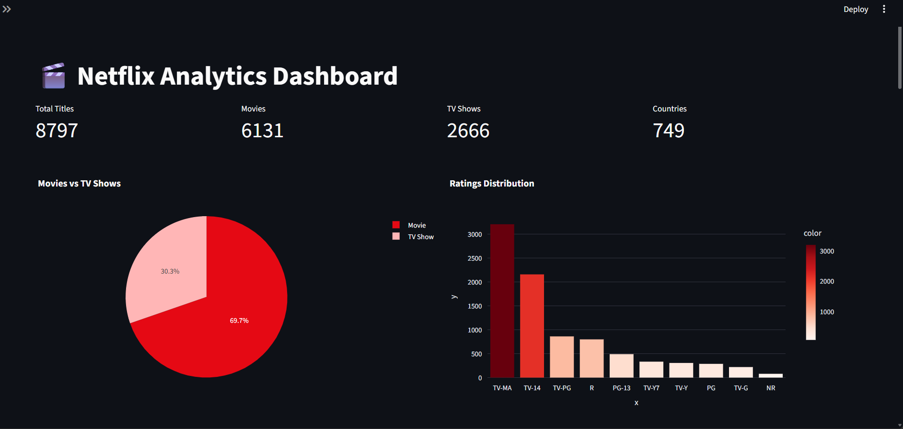
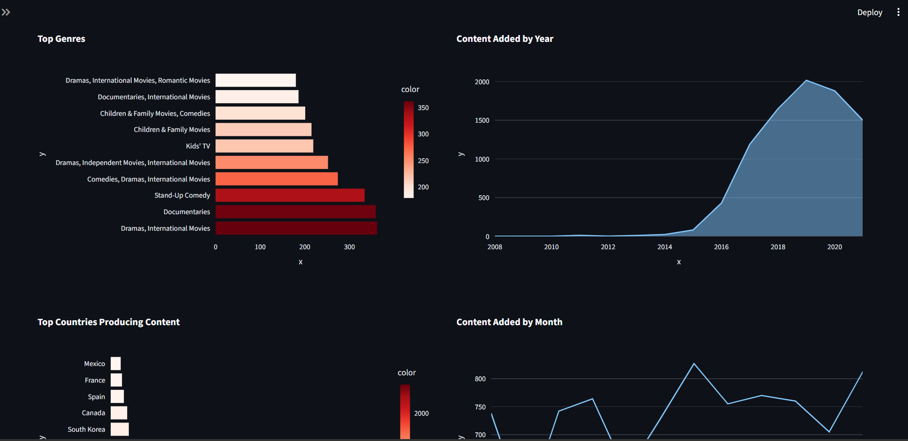
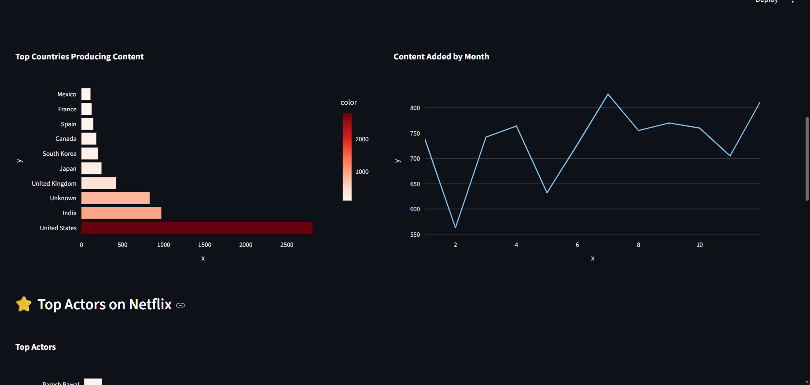
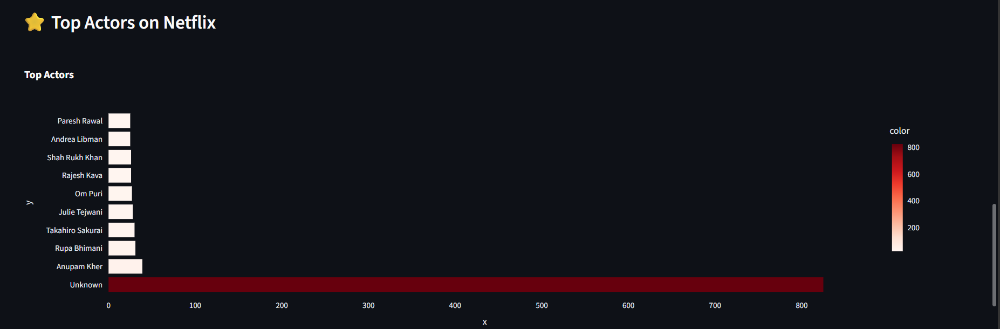
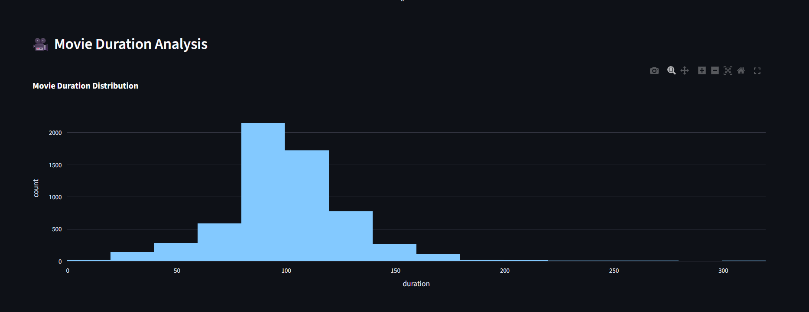
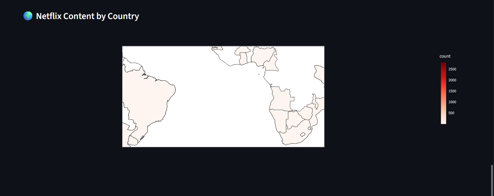

# 🎬 Netflix Analytics Dashboard

An interactive **Netflix Analytics Dashboard** built using **Python, Streamlit, Pandas, and Plotly** to analyze and visualize Netflix Movies and TV Shows data.

This project demonstrates **data cleaning, exploratory data analysis (EDA), and interactive visualization** to uncover insights about Netflix content such as genres, ratings, release trends, actors, and global distribution.

---

# 🌐 Live Dashboard

🔗 **Streamlit App:**  
https://netflix-analytics-dashboard-7tck6eppnzyrpdlcjtr68f.streamlit.app/
---

# 📊 Project Overview

The Netflix Analytics Dashboard provides a visual exploration of Netflix's content library through interactive charts and analytics.

The dashboard helps users understand:

- Distribution of **Movies vs TV Shows**
- Popular **Netflix content ratings**
- **Top genres** available on Netflix
- Growth of Netflix content over time
- Monthly trends of content releases
- **Top countries producing Netflix content**
- **Top actors appearing on Netflix**
- Distribution of movie durations
- Global Netflix content distribution using a **world map**

---

# 🚀 Features

✔ Interactive analytics dashboard  
✔ Movies vs TV Shows distribution  
✔ Ratings distribution visualization  
✔ Top genres analysis  
✔ Content added by year analysis  
✔ Monthly Netflix content trends  
✔ Top countries producing Netflix content  
✔ Top actors analysis  
✔ Movie duration distribution  
✔ Global Netflix content map  

---

# 🛠 Technologies Used

The dashboard was built using:

- **Python**
- **Streamlit**
- **Pandas**
- **Plotly**
- **Data Visualization**
- **Exploratory Data Analysis (EDA)**

---

# 📂 Dataset

The dataset used in this project is the **Netflix Movies and TV Shows dataset** from Kaggle.

The dataset includes information such as:

- Title
- Type (Movie / TV Show)
- Director
- Cast
- Country
- Release Year
- Rating
- Duration
- Genre
- Date Added

Dataset Source: Kaggle

---

# 📸 Dashboard Preview

### Dashboard Overview

### Ratings Distribution

### Genre Analysis

### Content Added by Year

### Top Actors on Netflix

### Movie Duration Analysis

---

# 📈 Key Insights

Some interesting insights discovered from the analysis:

- Netflix contains significantly more **movies than TV shows**
- **Drama and international movies** are among the most popular genres
- Netflix content grew rapidly after **2016**
- The **United States and India** produce a large portion of Netflix content
- Most movies have a duration between **90–120 minutes**

---

# 🏗 Project Architecture

Netflix Dataset  
        ↓  
Data Cleaning (Pandas)  
        ↓  
Exploratory Data Analysis  
        ↓  
Visualization (Plotly)  
        ↓  
Interactive Dashboard (Streamlit)  
        ↓  
Deployment (Streamlit Cloud)

---
The dashboard will open in your browser.

---

# 💡 Future Improvements

Possible enhancements for this project:

- Add advanced filtering options
- Build a Netflix recommendation system
- Add user authentication
- Integrate real-time streaming platform data
- Deploy the dashboard as a full analytics platform

---

# 🧠 Skills Demonstrated

- Data Cleaning
- Exploratory Data Analysis (EDA)
- Data Visualization
- Interactive Dashboard Development
- Python Programming
- Streamlit App Deployment

---

# 👩‍💻 Author

**Asha Jyothi**

Aspiring **Data Analyst** passionate about data visualization, analytics, and building interactive dashboards.

---

# ⭐ If you found this project useful

Please give this repository a **star ⭐ on GitHub**.

